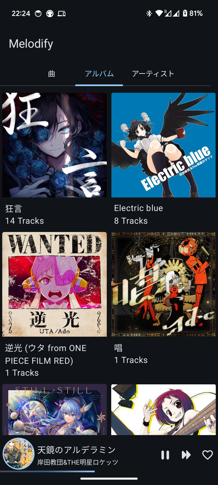
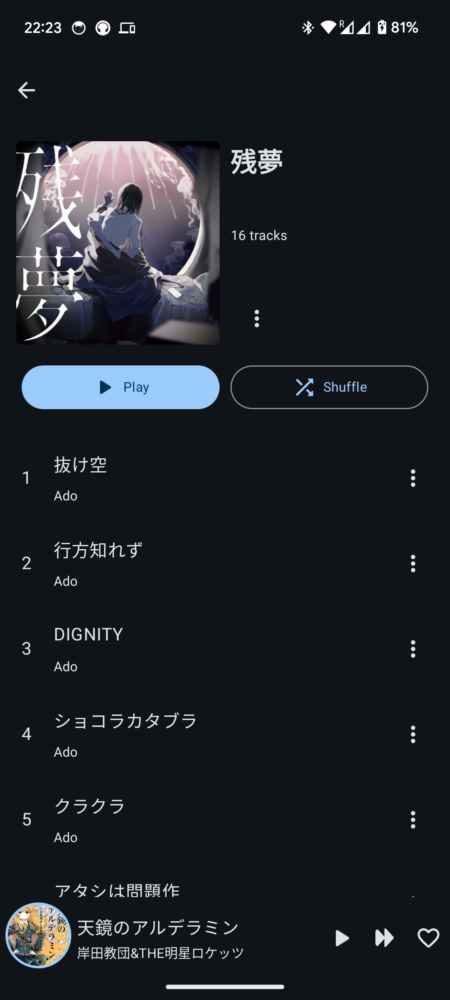
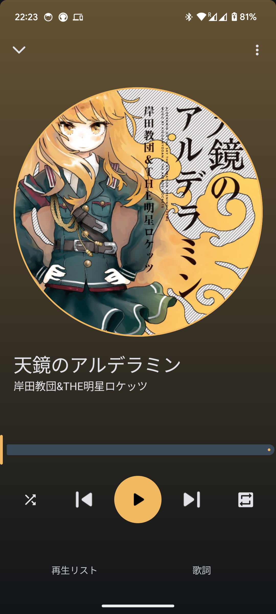
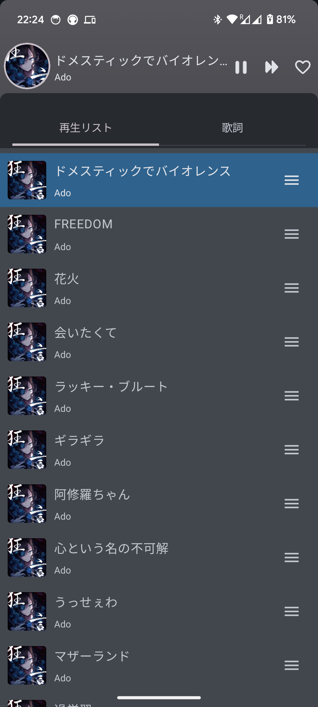
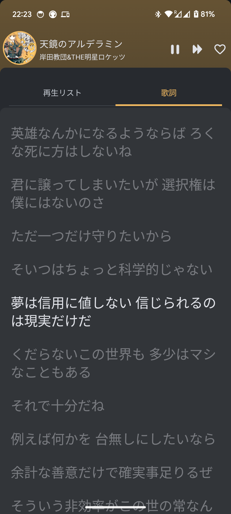

# Melodify
This app is designed for playing local music files, with a UI/UX inspired by YouTube Music. 

It's currently in the early stages of development, so feel free to report any issues or suggestions.

  
  
  
  
  

## Feature
 - Dark theme which will protect your eyes.
 - Reorder or delete music in the play queue.
 - Lyrics feature powered by [Lrclib](https://github.com/tranxuanthang/lrclib)

## Stack
 - Implement by Jetpack Compose.
 - Playing Audio with Media3.
